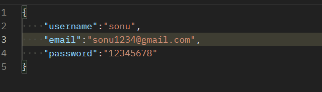
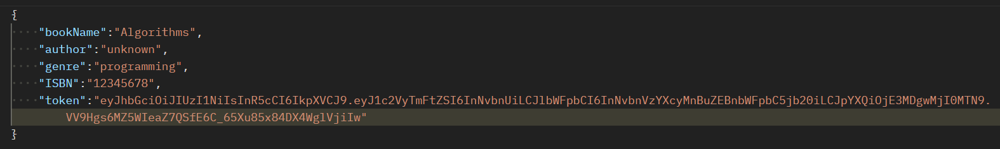
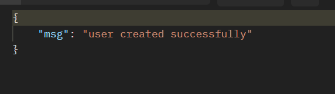
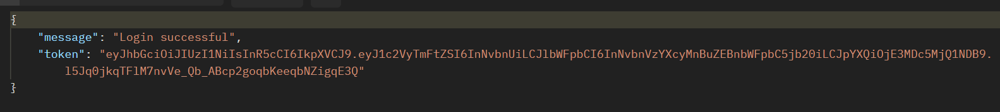
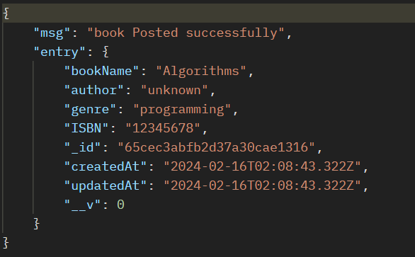
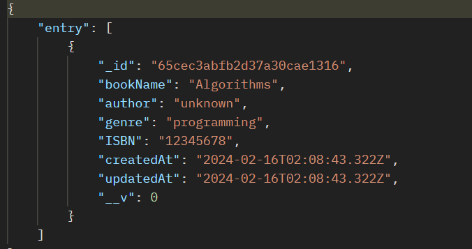

# Library api

This Api will going to handle all the stuff for mangagin Library

# Features

1. Password Hashing
2. Tokenization
3. search book by query parameter

# usage:

**Endpoints:**

POST :  `user/signup`

<h6>Note: Input Field name should be    1. For username : 'username'   2. For email : 'email'   3. For password : 'password'

POST :  `user/login`

<h6> Note: Input Field name should be     1. For userIdentification either email or unique UserName : 'userField'   2. For password Field: 'password'

POST :  `admin/postBook`

<h4> note: it is only accessible when user or Admin is logined  note: input field should be named as Follows:  1. bookName:'bookName'   2. author: 'author'   3. genre: 'genre'   4. token: 'token' (token should is provided as token verification is done in serverSide)

* POST :` /getBook/:bookName`

  <h4> A particular book can be searched using book name it accpt a query string parameter 

---

### Request format :

<h3> Both endpoints accept JSON requests with the following format: 

1. For signUp

   
2. For Login

   
   3. For posting Book  :

   
   4 . when requesting for particular book:

   

   # Response Fromat:

   <h3> It returns response in the form of JSON

   1. For Signup :

      
   2. For Login :

      
   3. when bookGet Posted:

      

      4. when we request for Particular book
         
