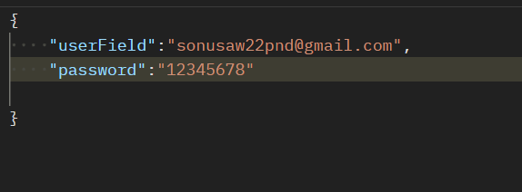

# Library api

This Api will going to handle all the stuff for mangagin Library

# Features

1. Password Hashing
2. Tokenization
3. search book by query parameter

# usage:

**Endpoints:**

* POST :  `user/signup`

  <h6>Note: Input Field name should be    1. For username : 'username'   2. For email : 'email'   3. For password : 'password'
* POST :  `user/login`

  <h6> Note: Input Field name should be     1. For userIdentification either email or unique UserName : 'userField'   2. For password Field: 'password'

---

### Request format :

<h3> Both endpoints accept JSON requests with the following format: 

1. For signUp

   
2. For Login

   

   # Response Fromat:

   <h3> It returns response in the form of JSON

   1. For Signup :

      
   2. For Login :

      
